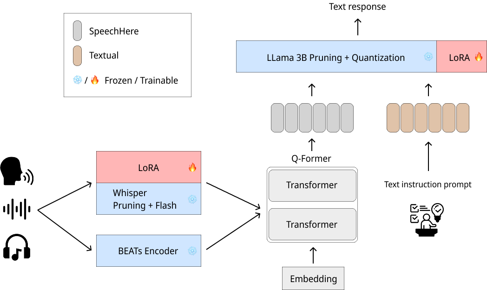

# Audiolm Evaluator
Audio Language Model Evaluator

## Install dependencies
```bash
git clone  https://github.com/boostcampaitech7/level4-recsys-finalproject-hackathon-recsys-08-lv3
pip install -r requirements.txt
```

## Evaluate
`inference_config.yaml` 에서 데이터셋 경로, 모델 경로 등을 적절히 수정한 후 아래 스크립트를 실행합니다.
```python
python evaluate_salmonn.py --cfg-path cfg_path  --mode {submission_asr, submission_aac}
```

# Model Structure



## LLM
- **Depth Pruning**: 30% of layers pruned.
- **Quantization & LoRA**: Applied QLoRA using `bitsandbytes`.

## Whisper
- **Depth Pruning**: 30% of layers pruned.
- **Optimizations**:
  - Integrated Flash Attention.
  - Used LoRA adaptors for fine-tuning.
