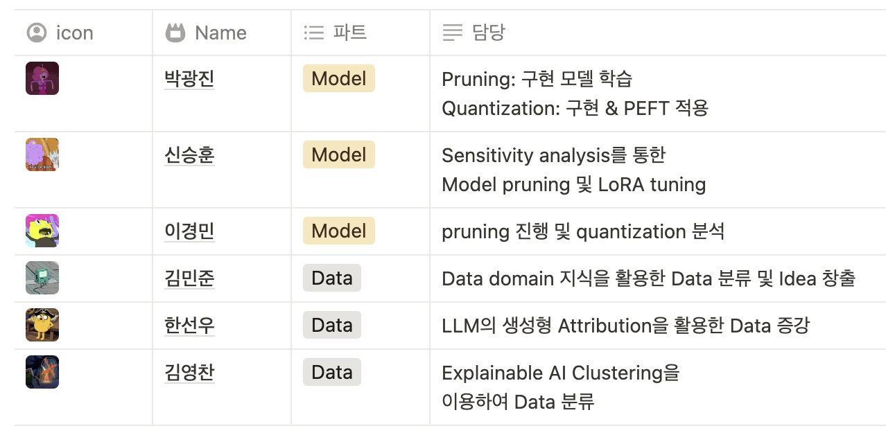
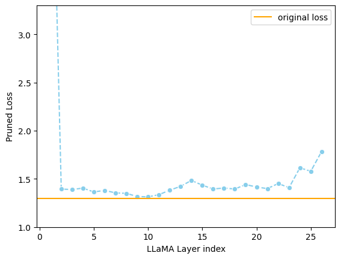
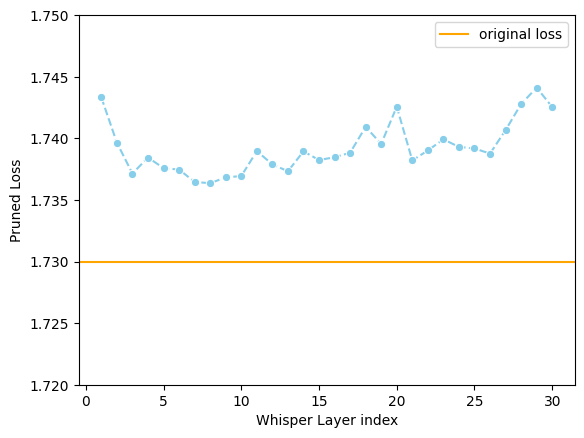

# TEAM NOTA-09 SALMONN Model

## Team



## Install dependencies
```bash
git clone  https://github.com/boostcampaitech7/level4-recsys-finalproject-hackathon-recsys-08-lv3
pip install -r requirements.txt
```

## Inference
`inference_config.yaml` 에서 데이터셋 경로, 모델 경로 등을 적절히 수정한 후 아래 스크립트를 실행합니다.
```python
python inference_salmonn.py --cfg-path inference_config.yaml --mode {submission_asr, submission_aac}
```

# Model Structure


## LLM
- **Depth Pruning**: 30% of layers pruned via sensitivity analysis.
- **Quantization & LoRA**: Applied QLoRA using `bitsandbytes`.



## Whisper
- **Depth Pruning**: 30% of layers pruned via sensitivity analysis.
- **Optimizations**:
  - Integrated Flash Attention.
  - Used LoRA adaptors for fine-tuning.


<br/>

# Results

| Model                  | Memory Usage | Latency | ASR |
|------------------------|--------------|---------|-----|
| Llama-3B              | 9.1GB        | 0.252   |  0.0641   |
| Compression One (Ours) | 5.87GB       | 0.198   | 0.073   |


<br/>
